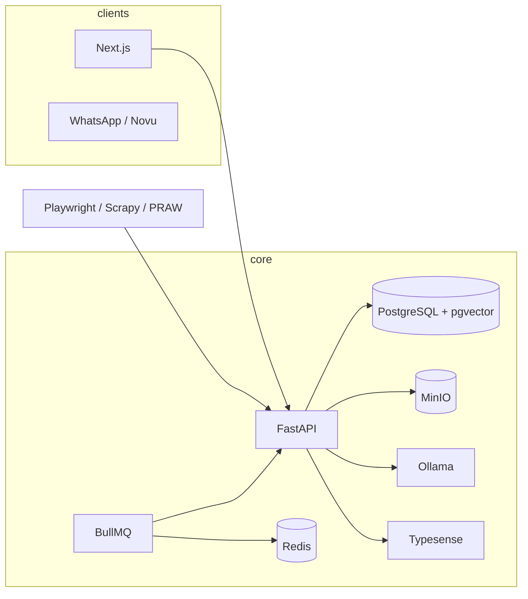

# WorkGraph architecture

## Monorepo layout

```
landing/                          # Next.js web (apps/web equivalent)
├── app/                          # Routes, API proxies
├── components/                   # UI (profile dashboard, auth shells)
├── lib/                          # Client utilities + workgraph-api.ts
├── packages/shared/types/        # Cross-service TypeScript types
├── job_aggregator/               # FastAPI + ingest + matching (services/api)
│   └── app/
│       ├── api/routes/           # REST: jobs, search, resume, ats, match, ingest
│       ├── ingest/               # Scrapers: greenhouse, lever, reddit, rss, …
│       ├── matching/             # sentence-transformers + pgvector-ready
│       └── services/             # resume_parser, ats_engine, ollama_client, storage
├── services/worker/              # BullMQ background jobs
├── infrastructure/               # docker-compose, prometheus, nginx
├── migrations/postgres/          # Self-hosted DB schema
├── supabase/migrations/          # Legacy hosted Supabase (migration path)
└── docs/                         # SETUP, LOCAL_DEVELOPMENT, DEPLOYMENT
```

## Data flow



## Clean architecture (API)

| Layer          | Responsibility                          |
|----------------|-----------------------------------------|
| `api/routes`   | HTTP, validation, rate limits           |
| `services`     | Business logic (ATS, resume, jobs)        |
| `repositories` | DB / REST persistence                   |
| `ingest`       | External job sources                    |
| `domain`       | Pydantic schemas, mappers               |

## AI stack (100% local)

| Task            | Technology                          |
|-----------------|-------------------------------------|
| Embeddings      | sentence-transformers (MiniLM)      |
| Resume NER      | spaCy `en_core_web_sm`              |
| Structured JSON | Ollama (DeepSeek, etc.)             |
| ATS analysis    | Keyword overlap + Ollama refinement |
| Vector search   | pgvector column on `jobs.embedding` |

## Auth strategy

**Phase 1–2:** Supabase Auth + profiles (default)  
**Phase 3:** Zustand + TanStack Query dashboard, community + wallet (WorkGraph API; auth stays Supabase)

## Implementation phases

1. **Foundation** (this delivery): Docker, Postgres schema, FastAPI resume/ATS/match, worker, docs
2. **Search & ingest**: Typesense indexing, Playwright scrapers, n8n schedules
3. **Product** (shipped): Dashboard tabs, community posts/votes, contributor wallet — see `docs/PHASE3.md`
4. **Notifications**: Novu + Socket.IO (planned)
4. **Ops**: Grafana dashboards, PostHog events, admin panel

## No vendor lock-in

All services run via Docker Compose on your infrastructure (Coolify, VPS, Kubernetes). No required paid APIs.
