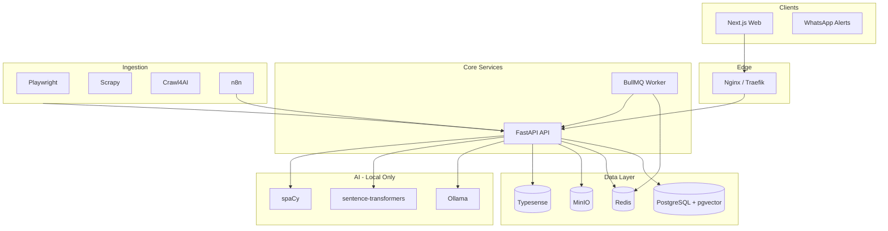

# WorkGraph Architecture

## Design principles

1. **No vendor lock-in** — every dependency can run on your own servers.
2. **Local AI first** — Ollama + sentence-transformers + spaCy; no OpenAI/Groq in production path.
3. **Modular monorepo** — clear boundaries between web, API, worker, infrastructure.
4. **Gradual migration** — Supabase/Groq paths remain until self-hosted stack is configured.

## Service responsibilities

| Component | Responsibility |
|-----------|----------------|
| `apps/web` (root Next.js) | Dashboard, profile UI, SEO pages, BFF routes |
| `job_aggregator` | Jobs CRUD, ingest, resume, ATS, embeddings |
| `services/worker` | Async scrape, ATS queue, notifications |
| `migrations/postgres` | Canonical schema for self-hosted mode |
| `infrastructure` | Docker Compose, monitoring configs |

## Data model (high level)

- `jobs` — normalized listings + `vector(384)` embeddings
- `wg_users` / `wg_profiles` — identity and structured career data
- `wg_ats_scores` — ATS history
- `wg_community_posts` — interviews, reviews, referrals
- `wg_wallets` — contributor earnings (Phase 3)

## Search path

1. **Typesense** — typo-tolerant keyword + facet search (Phase 2 indexer).
2. **pgvector** — semantic similarity for recommendations (`POST /match/jobs`).

## Auth path (planned)

SuperTokens Core + PostgreSQL recipe:

- Email/password, OTP, Google, GitHub, LinkedIn
- RBAC: `user`, `moderator`, `admin`

Until enabled, existing Supabase session flow in Next.js continues to work.

## Security layers

- API rate limiting (`slowapi`)
- Ingest routes require `JOB_AGGREGATOR_API_KEY`
- Upload size caps
- SQLAlchemy parameterized queries
- CORS restricted in production via `CORS_ORIGINS`

## Observability

- `GET /metrics` — Prometheus text format (basic)
- Grafana + Prometheus (`--profile monitoring`)
- Uptime Kuma for external probes

## Incremental delivery

See [SETUP.md](./SETUP.md) feature rollout table. Each phase ships working code—not placeholders.
